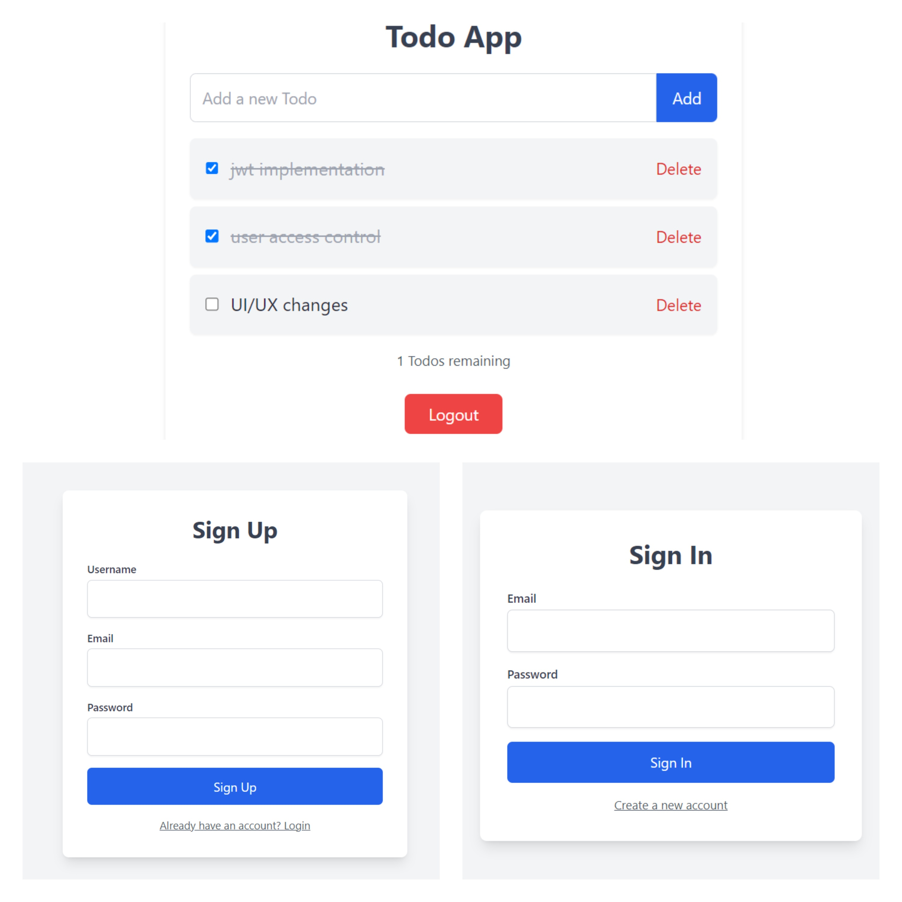

# TODO List Web App | MERN 

A Todo list web application built using the MERN stack (MongoDB, Express, React, Node.js), featuring user authentication (signup, login) and JWT-based authentication and authorization.



## Features

- **Login/Signup:** A login page for users to authenticate and access their profile.
- **Dashboard:** Manage and view your Todo tasks.
- **User Access Control:** JWT-based user authentication and authorization.

## Getting Started

Follow these instructions to set up and run the project locally.

### Prerequisites

Make sure you have the following installed:

- [Node.js](https://nodejs.org/) (which includes npm)
- [MongoDB](https://www.mongodb.com/) (running locally or provide a connection string)

### Installation

1. **Clone the repository:**

2. **Install backend and frontend dependencies:**

3. **Set up environment variables:**

## Usage

1. **Start the backend server:**

    ```bash
    cd backend
    npm start
    ```

2. **Start the frontend server:**

    ```bash
    cd ../frontend
    npm run dev
    ```

3. **Access the application:**

Contributions are welcome!
